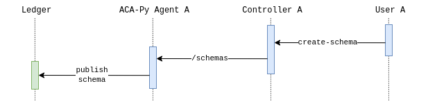
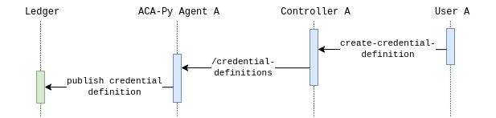
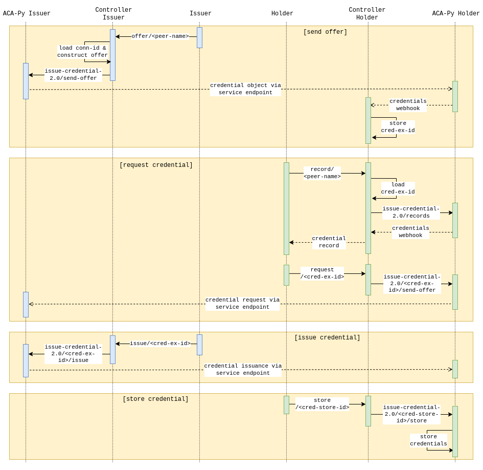

# ssi-agent

This is a sample implementation of an SSI (Self-Sovereign Identity) agent in golang which
can be used as a POC (Proof-Of-Concept). A user can interact with an executable instance
of this project via HTTP endpoints exposed to the public. To be more specific, this acts as a 
wrapper to [ACA-Py](https://github.com/hyperledger/aries-cloudagent-python) which is 
then also capable of establishing further connections with DLTs (Distributed Ledger 
Technologies) depending on the use-case.

## Functionalities

### DID-Exchange

* acknowledgments and insignificant webhooks are neglected

### Schema

### Credential Definition

For each schema, a credential definition should be published with public keys for each 
attribute such that a verifier can verify at the attribute level.

### Issue Credential

* acknowledgments and insignificant webhooks are neglected
* credential exchange IDs in two agents are different and unique
* procedure starts from issuer sending an offer to holder
