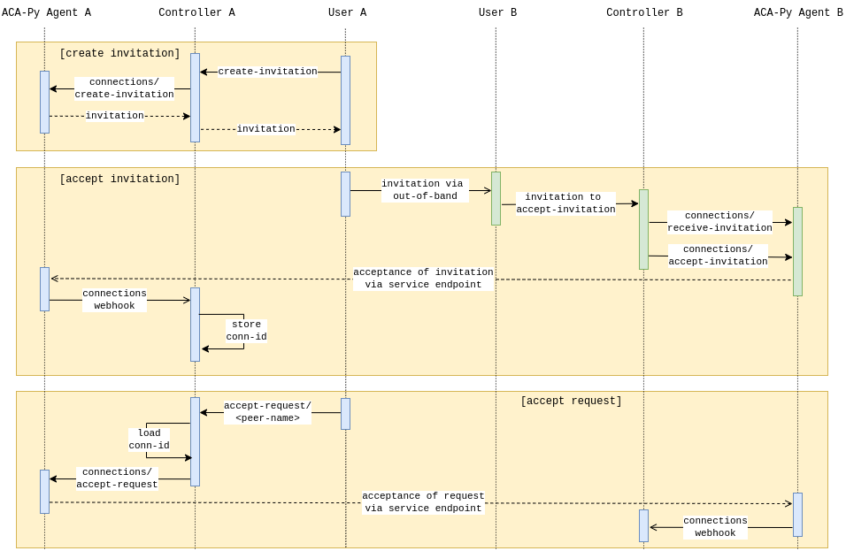

# ssi-agent

This is a sample implementation of an SSI (Self-Sovereign Identity) agent in golang which
can be used as a POC (Proof-Of-Concept). A user can interact with an executable instance
of this project via HTTP endpoints exposed to the public. To be more specific, this acts as a 
wrapper to [ACA-Py](https://github.com/hyperledger/aries-cloudagent-python) which is 
then also capable of establishing further connections with DLTs (Distributed Ledger 
Technologies) depending on the use-case.

## Functionalities

### DID-Exchange

* acknowledgments and insignificant webhooks are neglected

### Schemas

### Credential Definitions

### Issue Credential
